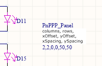

# PnPPP - Pick & Place Pre-Processor

PnPPP is a tool for automatically converting PCB assembly files to the format required by your fab or machine,
automatically rotate parts to the correct orientation and duplicate pick-and-place data with new positions
for the purpose of panelization. All required meta data can be maintained directly within the CAD project.

The tool was developed to process output files from Altium CircuitStudio for use with JLCPCB's self-service
PCBA interface, but it can be configured flexibly and potentially be used with other CAD programs and
different fabs.

## Features

* Parse and re-generate BOM (bill of materials) and PNP (pick and place) files in CSV format
* Continuously scan sub directories of a given file path for changes and automatically process changed files
* Rename, re-order and delete columns in BOM and PNP files
* Remove extra lines not conforming with the CSV format (what were you thinking, Altium?)
* Move output files to alternate destination path
* Auto-rotation: rotate parts in pick-and-place file based on per-component setting in the BOM file
* Panelization: duplicate pick-and-place information with ajusted coordinates to generate PCB panels from a single board
* All meta data (for auto-rotation, panelization etc.) can be managed from within the CAD project
* Input and output format customizable through a JSON config file

## Auto-Rotation

I frequently ran into the problem that orientation of a part in my library was different than what the fab
expected. As a result, the rotation of the part was wrong in the fab's preview. There
were two ways to fix this: either rotating the graphics in the footprint (which breaks the design) or manually
editing the generated pick-and-place file (tedious, error-prone and needed to be done again everytime
the files were re-exported).

PnPPP solves this problem once and for all: it automatically rotates components as needed and
generates a modified pick-and-place file in the format the fab expects. In order to do this, PnPPP first
needs to know which components need to be rotated and by what offset. A different tool relies on a seperate
file which contains a list of all components to be rotated and the respective angles... from a logical point
of view however, I found it more appropriate to not have yet another file and instead specify this piece
of information directly in the component library. To achieve this, I am using a custom parameter named
`JlcRotation` on every schematic symbol that needs rotation. This parameter is automatically added by
PnPPP to the rotation of all instances of the respective component.

Note that `Rotation` is a mandatory per-instance parameter (i.e. it can be different for each instance of
a component on the PCB), while `JlcRotation` is an optional per-symbol parameter (i.e. it is set only once
per each schematic symbol and applied to all instances of the part). The engineers at Altium in their
infinite wisdom provided no possibility for CircuitStudio users to configure which fields to export as part
of a pick-and-place file, therefore PnPPP pulls this information out of the BOM and then applies it on the
pick-and-place data.

So whenever you find the rotation of a part to be incorrect, you can simply open the schematic symbol in
your library, add a `JlcRotation` parameter, and let PnPPP do the work. From then on, whenever you use
the `Generate outputs` feature, PnPPP will know what to do and automatically fix your pick-and-place files.

By the way: you don't have to use the name `JlcRotation` for the parameter. You can configure a custom
parameter name in `config.json` so your library could even contain different rotation offsets for different
fabs.

## Panelization

The optional panelization feature in PnPPP enables you to automatically generate BOM and pick-and-place files
for 1- or 2-dimensional PCB panels. If using this feature, PnPPP automatically duplicates all components
multiple times and adjusts the position of the copies to accomodate for a panel with multiple instances
of the same PCB. The meta-data required can be edited conveniently within your schematic file.

This feature is useful if you want to manually panelize a PCB. While CircuitStudio supports embedded board
arrays (which allows you to generate gerbers for a panel), CircuitStudio can still only export BOM and pick-and-place
files for a single PCB and not the whole panel. This is where PnPPP comes in: it takes the files for a
single PCB as an input and outputs files for the panel.

In order to use this feature, PnPPP requires 6 values: the number of columns and rows, the
x and y offset of the bottom-leftmost PCB within the panel and the x and y spacing between boards. Since it
makes a lot of sense to maintain this information within the CAD project instead of an external configuration
file, PnPPP retrieves this information from a single special item within the BOM, named `PnPPP_Panel`.
It is recommended that you create a schematic symbol with the default designator `PnPPP_Panel` and
the type `Mechanical` (which puts the item in the BOM but not on the PCB). You can
then place this symbol in your schematic file and set its `Comment` to the comma-seperated 6 values.
If no item with this designator is found in the input BOM, the panelization feature will be disabled
for the given project. An example of the schematic symbol is shown below:

The panelization feature automatically uses the same length unit (`mm`, `mil`, `in`) as the pick-and-place file.
To keep designators unambiguous, a suffix is appended to all designators, i.e. `C1` becomes `C1_PX2Y3` for the
2nd column and 3rd row.

## Installation

PnPPP is an application based on NodeJS. It was developed and tested on a Mac, processing files on a
network volume shared with the Windows PC running CircuitStudio.
PnPPP will most probably work just fine on a Linux or Windows PC with NodeJS - I just cannot give
specific installation instructions. The following is what works on Mac:

1. Install NodeJS (and npm, which is normally included) if you don't already have them
2. Clone the repository, and in that folder run `npm install` to install the dependencies
3. Edit the `config.json` file (see Configuration)

PnPPP has no project-specific arguments or settings. This means you only need to setup the tool once
and you can then use it for all of your PCBs without having to change anything. All required
information can be maintained directly within the respective CAD projects.

## Operation

1. Run `npm start`. It will keep running and process any changed files
2. Generate output files in CircuitStudio - PnPPP will automatically detect and process those
3. Abort PnPPP by pressing `ctrl+c`

If you want to simply have the tool working at all times, you can configure your computer to
automatically run it when the OS boots. PnPPP will run in the background and use almost no system resources.

*Important:* for Auto-Rotation and Panelization to work, make sure you (re-)generate **both** a PNP and a BOM file
for a project at least once after PnPPP is started. It is NOT sufficient to generate just one of them, even if
the other one already exists. You can easily ensure this by using the `Generate outputs` dialog in CircuitStudio
and keeping both checkboxes ticked. Don't like this limitation? Fork PnPPP and improve it, it's open source.

## Configuration (only required once)

- `baseDir`: Specify a base path, i.e. the topmost directory to scan. All your PCB projects should be sub-directories of that one. It does not matter how deep the tree is, as all sub folders will be scanned. Currently only absolute paths are supported for `baseDir`.
- `bom`, `pnp`: Specify regular expressions that match the filenames of BOM and PNP files. They are matched against absolute paths of the files changed. The default expressions in the config file match the default names that CircuitStudio uses. There must be two capture groups within a RegEx: the path to the PCB project and the name of the project that CircuitStudio puts into the filename.
- You can specify which columns of the file you want to appear in the output file and also change the column names. The property name in the JSON is the original
column name and the value is the new name.
- In the default config, the tool assumes that CircuitStudio is set up to output an additional column named "LCSC" in the PNP file (which is used by JLCPCB to identify the component to be populated). You can remove that line in the config if not used.
- `autoRotation`: you can configure whether autoRotation is enabled or not. If enabled, you have to specify the name of the parameter in the BOM file
which specifies the additional rotation of its instances.

## How to set up CircuitStudio

- In the Schematic editor, add the parameter LCSC to a symbol to associate the part number JLC will use for PCBA.
- In the Schematic editor, add the parameter JlcRotation to any symbol you want auto-rotated and set the desired angle.
- In the PCB editor, go to `Project > Generate outputs`
- In the BOM section, enable the checkbox and click on `Configure`
- In the list of columns on the left side, check `JlcRotation` (this is only shown if at least one component in your project uses it)
- Under File Format, select `CSV`, then click `OK`
- Back in the `Generate outputs` dialog, under `Assembly`, check `Pick and place` and also configure it to output `CSV`
- Now whenever you click `Generate` in this dialog, PnPPP will automatically process the output files. That is, if PnPPP is running of course, duh :)

## Frequently asked questions

- **Can I use Ref X / Ref Y instead of Mid X / Mid Y?** Yes, simply adapt the config file. Note that the column name in the `panelization`
section have to match the (selected or renamed) columns in the `columns` section.
- **Do I have to enter the path to my project as `basePath`?** No. You can do that if you only ever work on a single project. But normally you would enter the directory which all your PCB projects reside in. PnPPP is smart enough to tell them apart.
- **Does PnPPP panelize Gerber files?** No. PnPPP can generate pick-and-place files for panelized boards from a single board. You can use other tools
(or an embedded board array in CircuitStudio) to panelize the Gerbers.
- **Does it run on Windows?** Probably, but I haven't tried. It's interpreted code, so there is no machine-specific binary.
